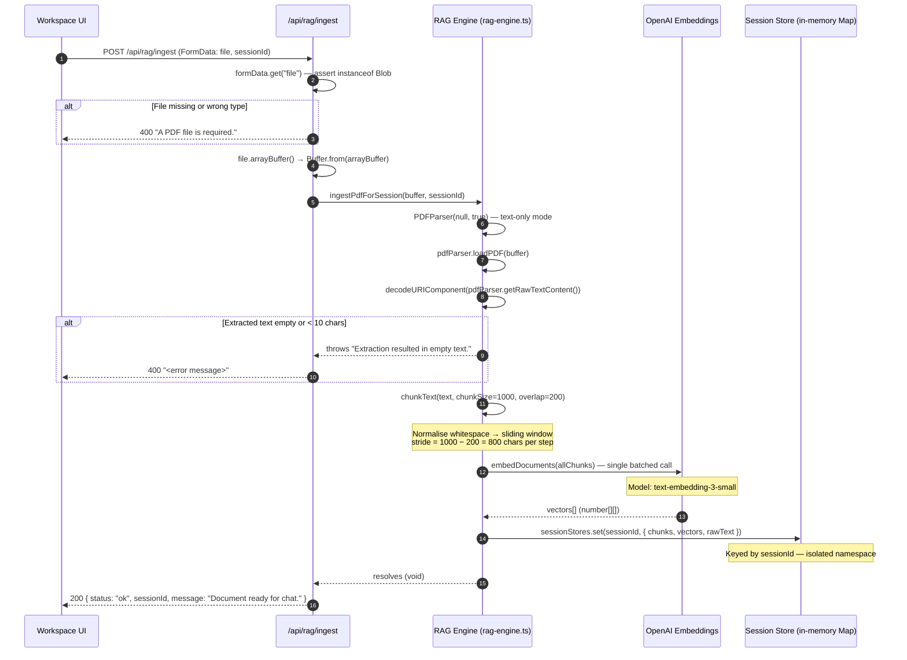
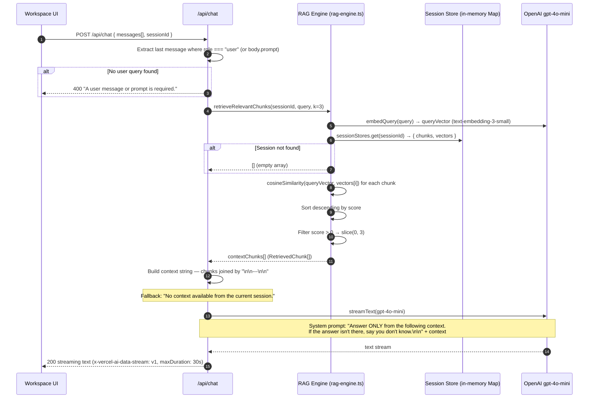
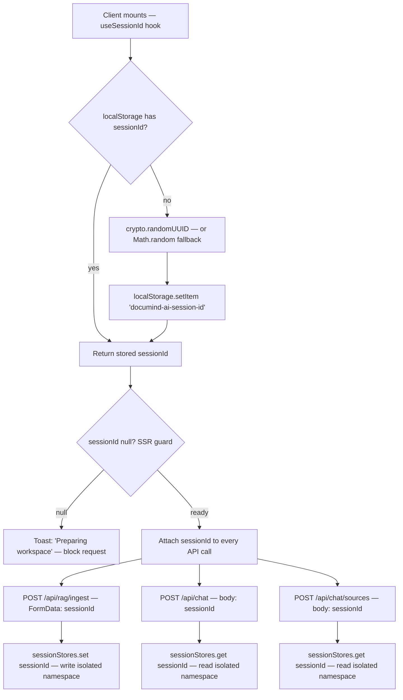
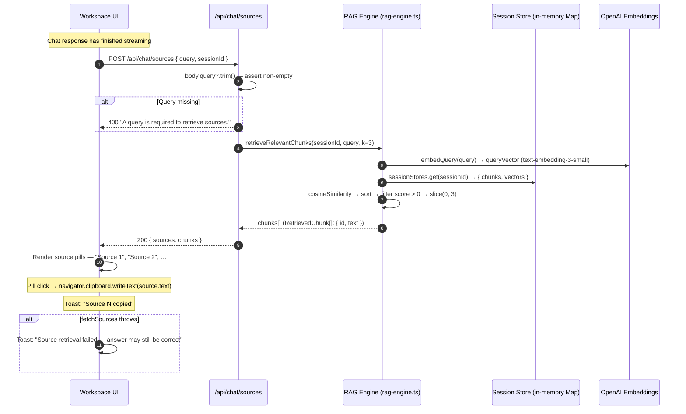

# DocuMind AI | Architecture Flows

This document captures the core runtime flows that define DocuMind AI's current behavior:

- PDF ingestion: parse → chunk → embed → session-scoped in-memory store
- RAG retrieval: cosine similarity scoring and context construction
- Session isolation: localStorage-persisted UUID as in-memory scope boundary
- Sources/citation flow: top-3 chunk retrieval for evidence pills

Use this file as the engineering source of truth for flow-level behavior.  
When implementation changes, update this doc in the same PR.

---

## How to Read These Diagrams

- **UI** = operator-facing workspace page (`src/app/workspace/`).
- **`/api/rag/ingest`** = ingestion pipeline: validate → extract → chunk → embed → upsert into session store.
- **`/api/chat`** = RAG chat route: retrieve → construct context → stream GPT-4o-mini response.
- **`/api/chat/sources`** = citation route: returns top-3 relevant chunks for source pills.
- **RAG Engine** (`src/lib/ai/rag-engine.ts`) = PDF parser, chunker, OpenAI embedder, and cosine retrieval.
- **Session Store** = global in-memory `Map<SessionId, SessionStore>`; session-scoped, no persistence beyond the server process.
- **`useSessionId` hook** (`src/hooks/use-session-id.ts`) = generates and persists the session UUID in `localStorage`.

Status code conventions used across flows:

- `400` malformed or invalid request (missing file, missing query, no session)
- `500` unexpected server or pipeline error

---

## 1) PDF Ingestion Pipeline

### Why this exists

Uploaded PDFs must be parsed, segmented, and embedded before any retrieval can happen.
The ingestion pipeline is the only write path into the session-scoped vector store —
nothing reaches the in-memory store without passing through it first.

### What the user should understand

Uploading a PDF triggers a sequential pipeline: text extraction → chunking → batched embedding → in-memory store upsert.
All vectors are keyed to the active `sessionId` so no two sessions can see each other's data.
On success the UI receives `{ status: "ok" }` which unlocks the chat interface.

### What this flow guarantees

- Only a valid `Blob` file is accepted; all other form data types are rejected with `400`.
- Text extraction uses `pdf2json` server-side — no PDF content reaches the client.
- Chunks are 1,000 characters with a 200-character overlap; this contract is enforced by tests.
- A single batched `embedDocuments()` call embeds all chunks before the first vector is stored.
- All vectors are written into the session-scoped namespace only — never into a global index.

### Diagram

---

## 2) RAG Chat + Streaming Flow

### Why this exists

Retrieval-augmented generation grounds every response in the user's uploaded document.
Without the retrieval step the model would answer from parametric memory alone, which
is exactly what DocuMind AI is designed to prevent. The context window sent to GPT-4o-mini
is bounded to the top-3 semantically closest chunks from the active session.

### What the user should understand

Every chat query triggers a two-stage flow before any token is streamed:

1. **Retrieval** — the query is embedded and ranked against the session's stored vectors via
   cosine similarity. The top-3 chunks scoring above `0` are selected as context.
2. **Streaming generation** — GPT-4o-mini receives a system prompt that constrains it to
   answer only from the provided document context. If context is unavailable, a fallback
   string is injected so the model can gracefully declare ignorance.

### What this flow guarantees

- Retrieval is always scoped to the active `sessionId` — no cross-session reads.
- Chunks with a cosine similarity score of `0` or below are excluded.
- If the session store is empty (no PDF ingested), the context falls back to
  `"No context available from the current session."` and the model responds accordingly.
- The system prompt enforces document-bounded answering — it does not make safety claims
  beyond instructing the model to say "I don't know" when the answer is absent.
- The response is streamed with `x-vercel-ai-data-stream: v1` headers for Vercel AI SDK compatibility.

### Diagram

---

## 3) Session Isolation

### Why this exists

The session store is a server-side in-memory `Map`. Without per-session scoping, any
request could read or overwrite vectors belonging to a different user's upload. The
`sessionId` is the sole trust boundary enforcing per-user data isolation across all
read and write operations.

### What the user should understand

On first mount, `useSessionId` generates a UUID (via `crypto.randomUUID()` or a
`Math.random` fallback) and persists it in `localStorage` under `"documind-ai-session-id"`.
The same ID is returned on every subsequent render. Both the PDF uploader and chat
interface read this hook as their single source of truth and attach the ID to every
API call. All server-side vector operations — ingest writes and retrieval reads — are
scoped to `sessionStores.get(sessionId)`.

### What this flow guarantees

- Cross-session data leakage is structurally impossible: the Map is keyed by `sessionId`
  and no global read path exists.
- Refreshing the page reuses the same `sessionId` (from `localStorage`) so previously
  ingested documents remain retrievable within the same server process.
- Both the uploader and chat interface guard against a `null` sessionId (during SSR) and
  display a `"Preparing workspace"` toast rather than sending an empty ID to the server.

### Diagram

---

## 4) Sources / Citation Flow

### Why this exists

Every streaming response is grounded in specific document chunks. The sources route
provides the UI with the exact text excerpts that informed the answer, allowing the
user to verify claims and trace evidence back to the original PDF.

### What the user should understand

After a chat response completes, the UI issues a second POST to `/api/chat/sources`
with the same query. The route runs an identical retrieval call — `retrieveRelevantChunks`
with `k=3` — and returns the chunks as a `sources[]` array. Each source is rendered
as a clickable pill. Clicking a pill copies the full chunk text to the clipboard.

### What this flow guarantees

- Source retrieval uses the same cosine-similarity ranking as the chat route — the
  evidence shown always corresponds to the context the model actually received.
- A missing or blank query returns `400` before any vector read occurs.
- A failed sources fetch shows a toast but does not block or invalidate the chat answer.

### Diagram

---

## Key Constants Reference

| Constant            | Value                      | File                                     | Purpose                                        |
| :------------------ | :------------------------- | :--------------------------------------- | :--------------------------------------------- |
| Chunk size          | `1000` chars               | `rag-engine.ts`                          | Segmentation unit                              |
| Chunk overlap       | `200` chars                | `rag-engine.ts`                          | Context bridge between adjacent chunks         |
| Retrieval top-k     | `3`                        | `chat/route.ts`, `chat/sources/route.ts` | Max chunks per query                           |
| Relevance threshold | `score > 0` (cosine)       | `rag-engine.ts`                          | Floor filter — excludes zero-similarity chunks |
| Embedding model     | `text-embedding-3-small`   | `rag-engine.ts`                          | OpenAI embedding service                       |
| LLM model           | `gpt-4o-mini`              | `chat/route.ts`                          | OpenAI streaming completion                    |
| Vercel max duration | `30` seconds               | `chat/route.ts`                          | Streaming function timeout                     |
| Session storage key | `"documind-ai-session-id"` | `use-session-id.ts`                      | localStorage key for session persistence       |
| Ingestion flag key  | `"documind-ai-ingested"`   | `chat-interface.tsx`                     | localStorage gate — unlocks chat after upload  |
| Default session ID  | `"default-session"`        | all API routes                           | Fallback when no sessionId is provided         |

---

## Status Codes & Error Messages

| Endpoint                 | Status | Message                                                                                                   |
| :----------------------- | :----- | :-------------------------------------------------------------------------------------------------------- |
| `POST /api/rag/ingest`   | `400`  | `"A PDF file is required."`                                                                               |
| `POST /api/rag/ingest`   | `400`  | `"<error from pipeline>"` (e.g. empty extraction)                                                         |
| `POST /api/rag/ingest`   | `200`  | `{ status: "ok", sessionId, message: "Document ready for chat." }`                                        |
| `POST /api/chat`         | `400`  | `"A user message or prompt is required."`                                                                 |
| `POST /api/chat`         | `500`  | `"DocuMind AI encountered an issue generating a response. Please try again or reduce the document size."` |
| `POST /api/chat/sources` | `400`  | `"A query is required to retrieve sources."`                                                              |
| `POST /api/chat/sources` | `200`  | `{ sources: RetrievedChunk[] }`                                                                           |

---

## Update Rules (Keep This Accurate)

Update this document whenever any of the following changes:

- Chunking strategy, chunk size, overlap, or relevance threshold in `src/lib/ai/rag-engine.ts`
- Embedding model or embedding call shape in `src/lib/ai/rag-engine.ts`
- System prompt wording or message construction in `src/app/api/chat/route.ts`
- Top-k value, retrieval logic, or response shape in `src/app/api/chat/route.ts` or `src/app/api/chat/sources/route.ts`
- Session ID generation, localStorage key, or SSR guard in `src/hooks/use-session-id.ts`
- Ingestion validation rules or response contract in `src/app/api/rag/ingest/route.ts`
- Session store data structure (`SessionStore` type) or global singleton pattern in `rag-engine.ts`

If a code change alters runtime behavior but this doc is not updated, treat that as an incomplete PR.

---

## Suggested Companion Docs

- `docs/HARDENING_ROADMAP.md` for planned security enhancements and threat mitigations
- `README.md` for high-level product narrative and quick-start setup
